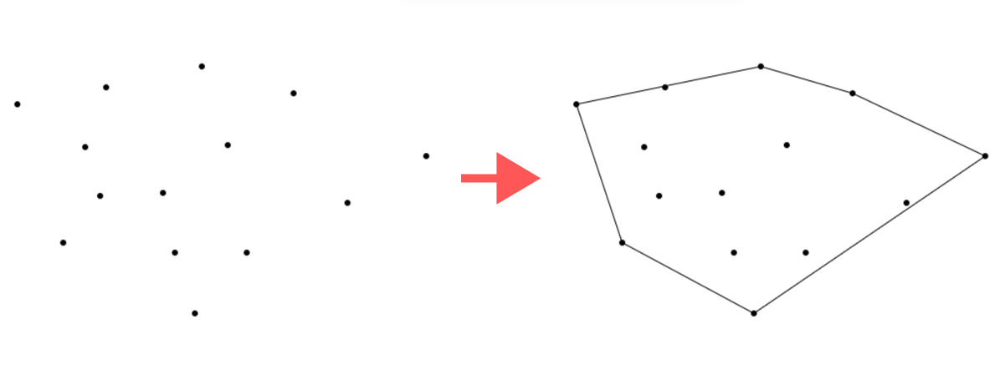
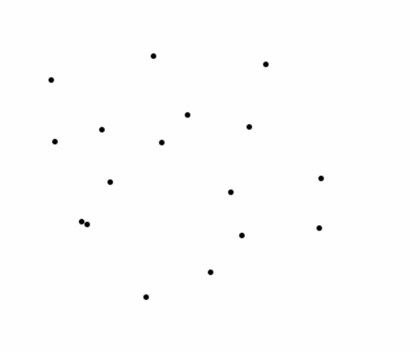
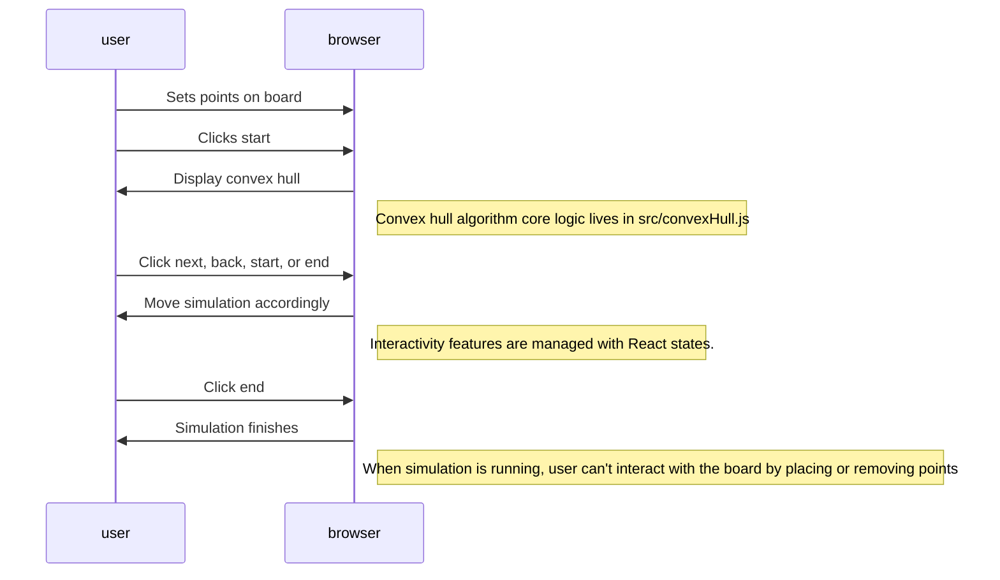

# Interactive Convex Hull Visualizer

- From scratch implementation, including computational geometry, visualization, and interactivity
- 0 lines of code written by AI

## Overview

The Convex Hull algorithm takes as input a set of points and finds the smallest convex sub-set that contains all the points.

This is an important algorithm in different areas such as image processing, route planning, and object modeling. It is also widely used in competitive programming.




## Features

- User can add points on the board.
- When clicking Start, the application shows the result of the Convex Hull algorithm with the given set of points.
- User can see the algorithm step by step using the controllers below the board.
- User can stop the simulation to provide a different set of points.



## Architecture

- Frontend was implemented using React 19 + ReactCanvas API
- Computational geometry + Visualization implemented with Javascript and DOM manipulation.
- Here is an overview of how the visualization is implemented:




## Run the project

Run locally typing the following in your terminal:

```bash
git clone https://github.com/LestathRiveraD/Interactive-Convex-Hull-Visualizer.git
cd Interactive-Convex-Hull-Visualizer/
npm i
npm run dev
```

## References

For reference, I'll leave the main sources of information while making this project:

- Convex hull construction - Algorithms for Competitive Programming. (2024). Cp-Algorithms.Com. https://cp-algorithms.com/geometry/convex-hull.html
- Stable Sort. (2020). Convex Hull Algorithm - Graham Scan and Jarvis March tutorial [Video]. YouTube. https://www.youtube.com/watch?v=B2AJoQSZf4M